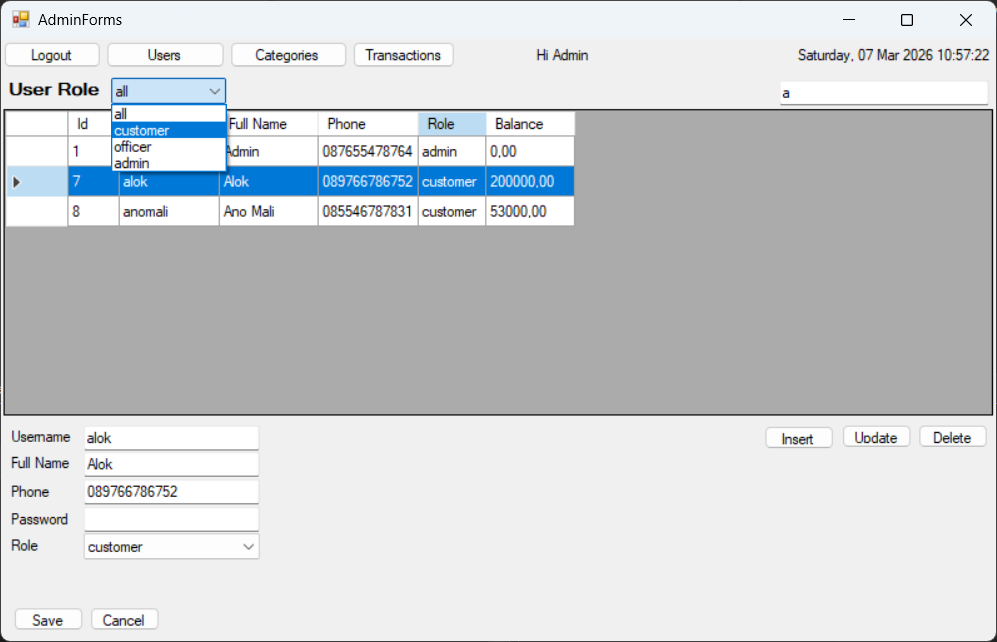
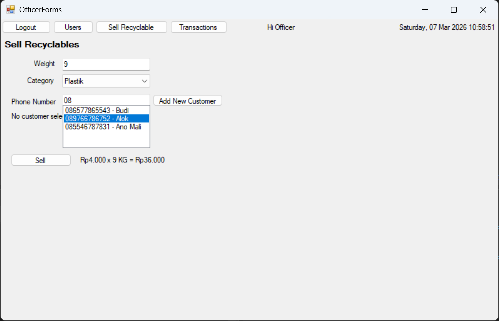
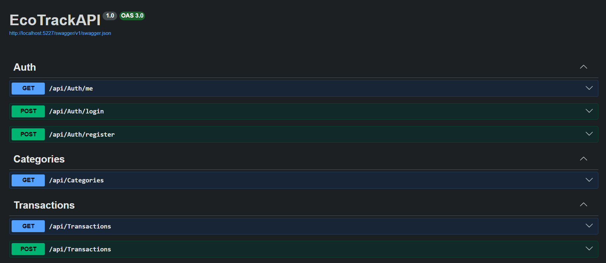
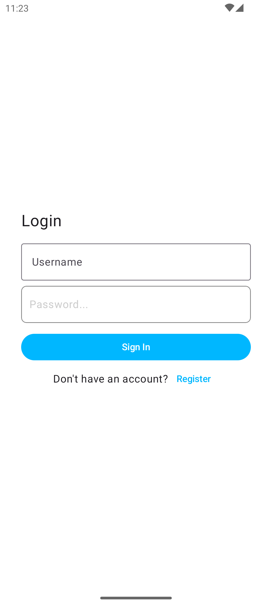
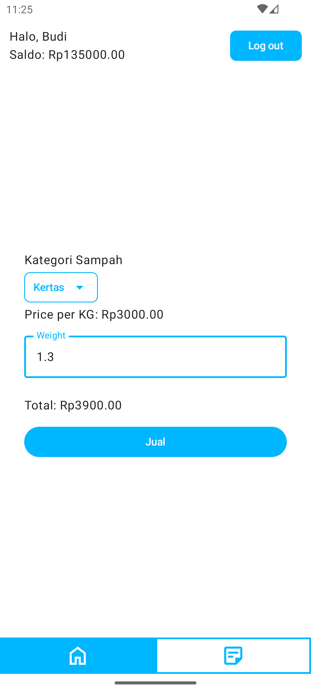

# EcoTrack
EcoTrack adalah sistem manajemen daur ulang sampah. Warga(Customer) dapat menjual sampah
daur ulang, petugas(Officer) menimbang dan mencatat transaksi, admin mengelola data.

## Desktop
Versi Desktop untuk mengelola data (`Category` & `User`) serta memantau `Transaction`. Officer juga dapat menimbang dan mencatat transaksi. 
User: Admin/Officer

  
  

## Web API
Versi Web API dengan integrasi `JWT`, berfungsi sebagai jembatan bagi user mobile untuk menjual sampah dan melihat riwayat transaksi. 
Consumer: Public/Authenticated

  

## Mobile (Android)
Versi Android untuk menjual sampah secara mandiri dan melihat riwayat transaksi dari Web API yang telah dibuat. 
User: Customer

  
  

